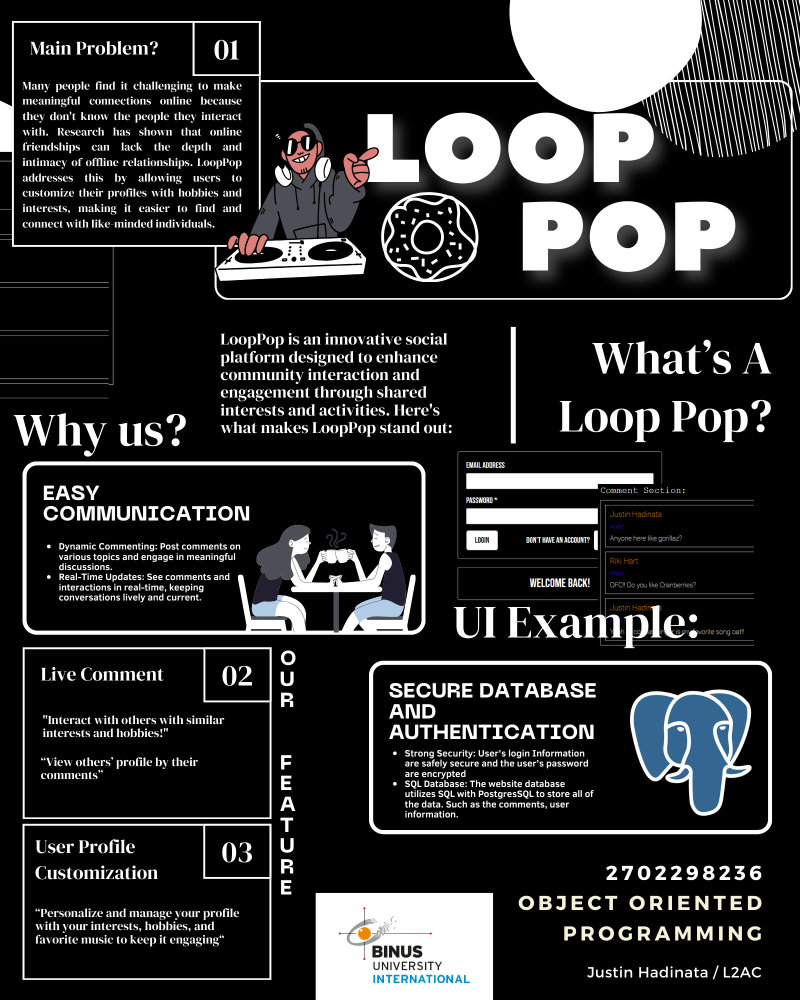
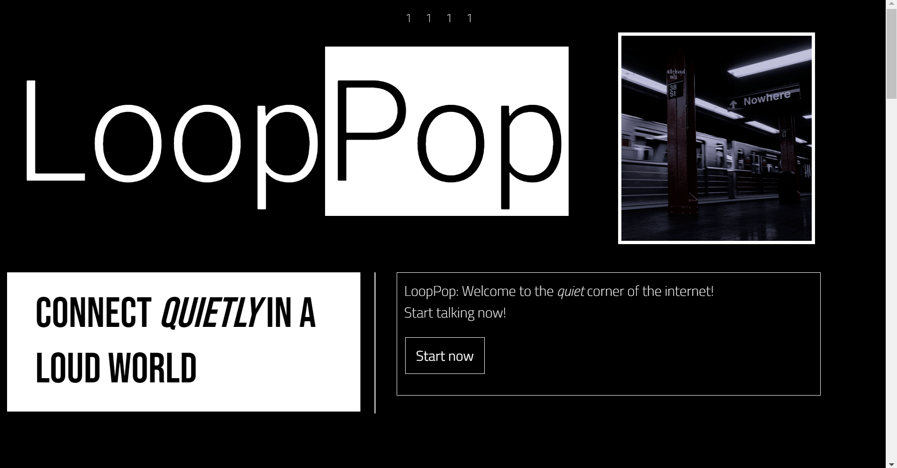
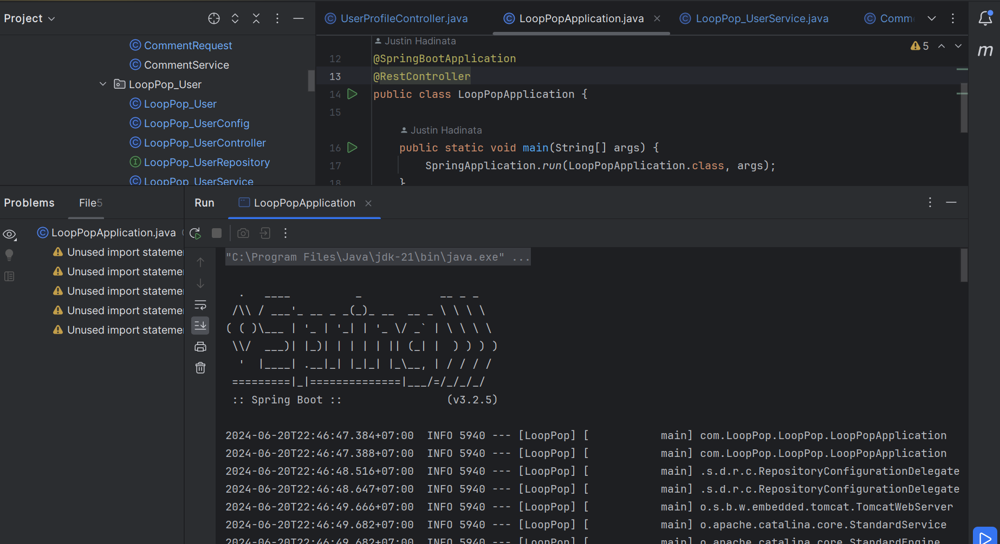
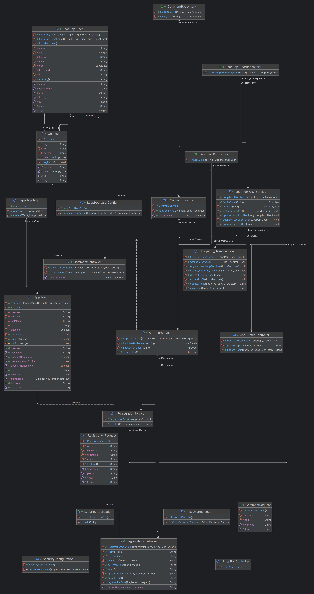

# Justin Hadinata 2702298236 / Final project / OOP / L2AC

  All of the documentation, demonstrations, and the class diagram are located in this repository.

## LoopPop!

## LoopPop: A Social Platform for Sharing and Discovering

LoopPop is a dynamic social platform that allows users to share their interests, hobbies, and favorite music with others. Built using Spring Boot, Java, Thymeleaf, and SQL, this project provides a user-friendly interface for registration, profile customization, and commenting.

## Technologies Used

- **Spring Boot**: A powerful framework that simplifies the development of production-ready applications.
- **Java**: The primary programming language used for the backend of the application.
- **Thymeleaf**: A modern server-side Java template engine for web and standalone environments.
- **SQL**: Used for managing and manipulating the application's database.
- **HTML/CSS/JavaScript**: Used for creating the frontend of the application.
- **Maven**: Used for build, publish, and deploy several projects at once for better project management.

## Features

- **User Registration and Authentication**: Users can create an account and log in securely.
- **Profile Customization**: Users can customize their profiles by adding their favorite hobbies and music.
- **Commenting System**: Users can post comments on various topics, tagged with relevant categories.
- **User Profiles**: Clicking on a commentor's name redirects the user to their profile page, displaying their favorite hobbies and music.

## Project Structure

The project is structured into three main components:

1. **AppUser**: Handles user registration and authentication.
2. **LoopPop_User**: Manages user customization and profile information.
3. **Comment**: Facilitates the creation and display of comments.

## Getting Started

To run this project locally, follow these steps:

1. Clone the repository.
2. Set up your database and update the application properties with the appropriate credentials.
3. Build the project using Maven.
4. Run the application.
5. Access the application in your browser at `http://localhost:8080`.

## Video Demonstration
[Watch the video demonstration here!](https://youtu.be/W4wNyJpvC6U)

## Screenshots

## Class Diagram

  
